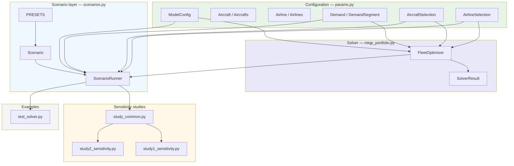
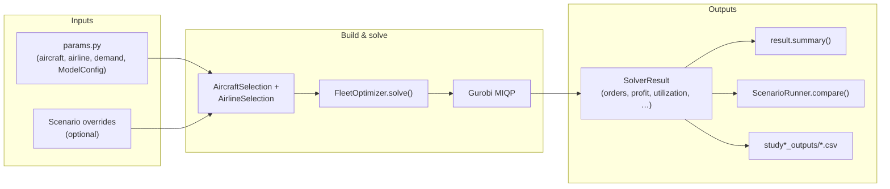
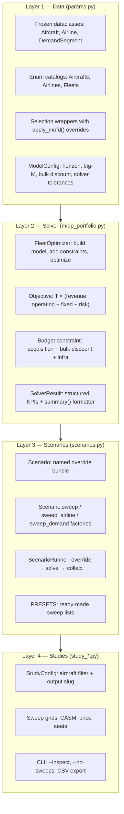
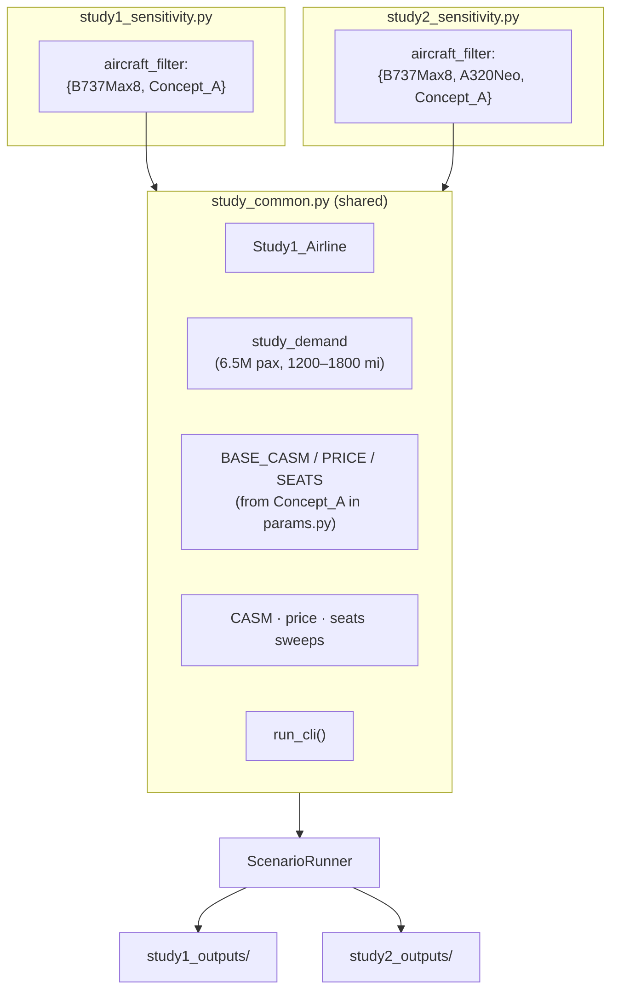

# AACES Codebase Diagram

Architecture for the fleet-acquisition MIQP solver and novel-aircraft-concept sensitivity studies.

For setup and runnable examples, see [README.md](README.md).

---

## 1. Module dependency graph

**Dependency rule:** everything reads configuration from `params.py`. The solver never imports study code; studies import the solver through `scenarios.py`.

---

## 2. End-to-end data flow

Each `ScenarioRunner.run_one()` call creates **fresh** selection objects, applies that scenario's overrides, solves once, and returns one `SolverResult`. Runs do not share mutable state.

---

## 3. Layer responsibilities

---

## 4. Sensitivity study structure

Study files are thin wrappers: they only declare **which aircraft are eligible** and **where CSVs go**. All sweep logic, scenario factories, and CLI live in `study_common.py`.

---

## 5. File reference

| File | Role |
|------|------|
| **params.py** | Single source of truth for aircraft catalog, airline profiles, default demand, and `ModelConfig`. Access data through `AircraftSelection` / `AirlineSelection`, not raw enums. |
| **miqp_portfolio.py** | `FleetOptimizer` builds and solves the MIQP; `SolverResult` packages all outputs (`orders`, financials, utilization, demand fulfillment, `summary()`). |
| **scenarios.py** | Declarative `Scenario` overrides + `ScenarioRunner` for isolated batch runs. `PRESETS` holds common sweeps. |
| **study_common.py** | Shared sensitivity-study machinery: demand, sweep grids, scenario factories, result tables, CLI, CSV export. |
| **study1_sensitivity.py** | Study 1 entry point: B737Max8 vs Concept_A. |
| **study2_sensitivity.py** | Study 2 entry point: B737Max8 + A320Neo vs Concept_A. |
| **test_solver.py** | Runnable tour of baseline solves, presets, and custom sweeps. |
| **historical_validation_breeze.py** | Optional historical validation: Breeze A220 acquisition case study (schedule CSV → demand → solve). |
| **study1_outputs/** · **study2_outputs/** | CSV sweep results written by the study scripts. |
| **AIAA paper** ([doi:10.2514/6.2026-4470](https://arc.aiaa.org/doi/abs/10.2514/6.2026-4470)) | Mathematical formulation; equation numbers map to comments and constraint builders in `miqp_portfolio.py`. |

---

## 6. Key classes (quick lookup)

| Class | Module | Purpose |
|-------|--------|---------|
| `ModelConfig` | params | Time horizon, big-M, MIP gap, bulk-discount rate/threshold |
| `AircraftSelection` | params | Read / override aircraft attributes; `families()`, `family_infra_cost()` |
| `AirlineSelection` | params | Read / override airline attributes; `fleet_count()` |
| `Demand` | params | List of `DemandSegment`s; `scaled(fraction)` |
| `FleetOptimizer` | miqp_portfolio | Build + solve MIQP for one airline |
| `SolverResult` | miqp_portfolio | All outputs; `annual_profit`, `total_profit`, `summary()` |
| `Scenario` | scenarios | Named parameter overrides |
| `ScenarioRunner` | scenarios | Apply scenario → solve → return `SolverResult` |
| `StudyConfig` | study_common | Per-study label, aircraft filter, output directory |
